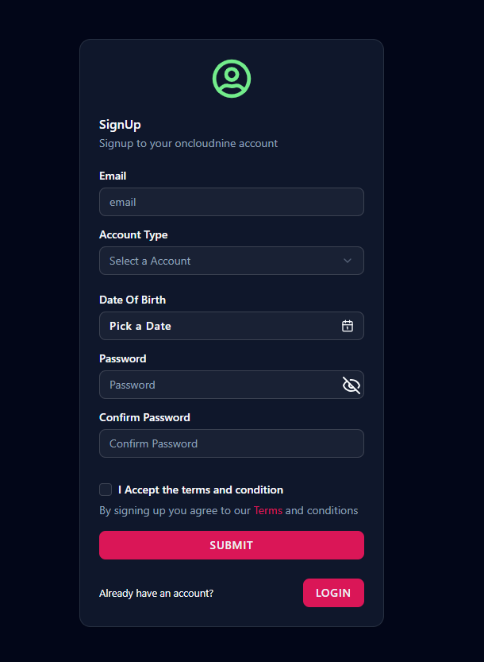

# Admin Dashboard App

A fully functional admin dashboard built using **Next.js**, **React**, and **Node.js**, designed for managing and visualizing data effectively. This app includes modern UI components, authentication, form validation, and interactive charts.

## 🚀 Features

- 🔐 **Authentication**
  - Sign in / Sign up with email credentials
  - OAuth login via **GitHub** and **Google**

- 🧑‍💻 **Tech Stack**
  - **Next.js** for server-side rendering and routing
  - **React.js** for component-based UI
  - **Node.js** for backend integration
  - **shadcn/ui** for styling and UI components
  - **Zod** for form validation
  - **Chart.js** for interactive chart displays

- 📊 **Dashboard Capabilities**
  - Responsive admin interface
  - Data visualization using Chart.js
  - Form handling with validation
  - User authentication and session management

## 📸 Screenshots

### Dashboard View


### Login Page


### SignUp Page




## 📁 Installation

```bash
git clone https://github.com/your-username/your-repo-name.git
cd your-repo-name
npm install
npm run dev
